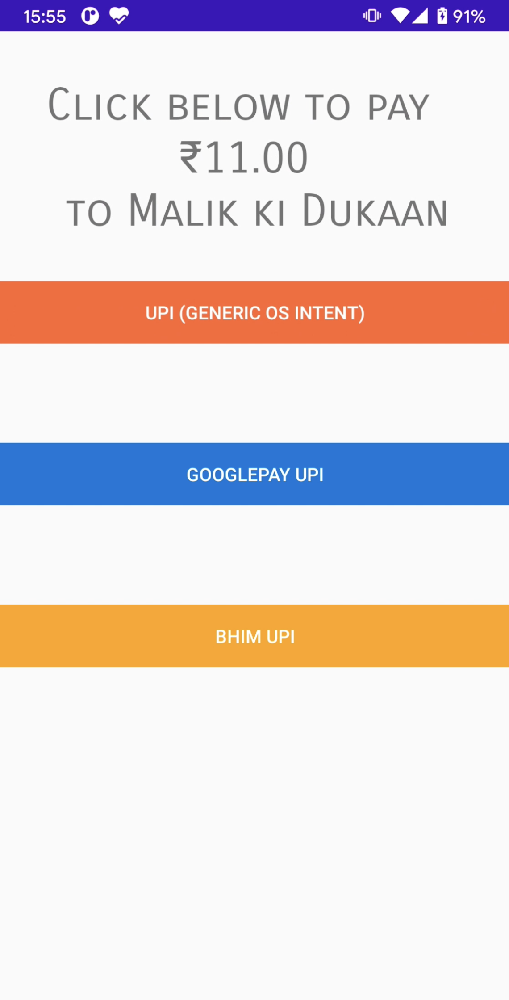
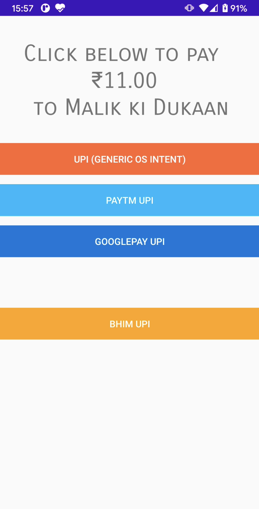
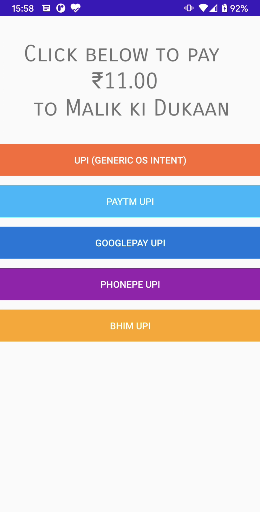

# UPISmartIntent
UPI Smart Intent sample application code.

Screenshots:
- The sample app displays various buttons to handle UPI intent in a smart manner
<table style="padding:10px">
    <col width="250px" />
    <col width="250px" />
    <col width="250px" />
    <tr>
        <td>

</td>
        <td>

</td>
        <td>

</td>
    </tr>
    <tr>
        <td>
Screenshot showing only two apps as Paytm & PhonePe are not UPI ready
</td>
        <td>
Screenshot showing only three apps as now only PhonePe is not UPI ready
</td>
        <td>
Screenshot showing all UPI apps as all now UPI ready
</td>
    </tr>
</table>

Summary:
- The first button invokes generic OS intent app chooser where Android OS lists all apps that can handle UPI intent
- The subsequent specific UPI app buttons invoke the specific apps to handle the UPI intent payment
- The smartness here is that the specific app buttons are visible only when the specific UPI app is both installed and has a UPI ready user avaialable
    - UPI readiness is as per the NPCI circular: https://www.npci.org.in/PDF/npci/upi/circular/2019/Circular-73-Payer_App_behaviour_for_Intent_based_transaction_on_UPI.pdf
  
